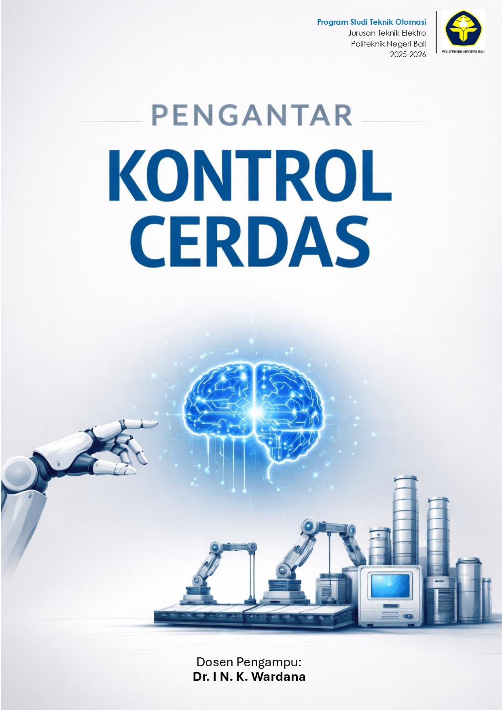
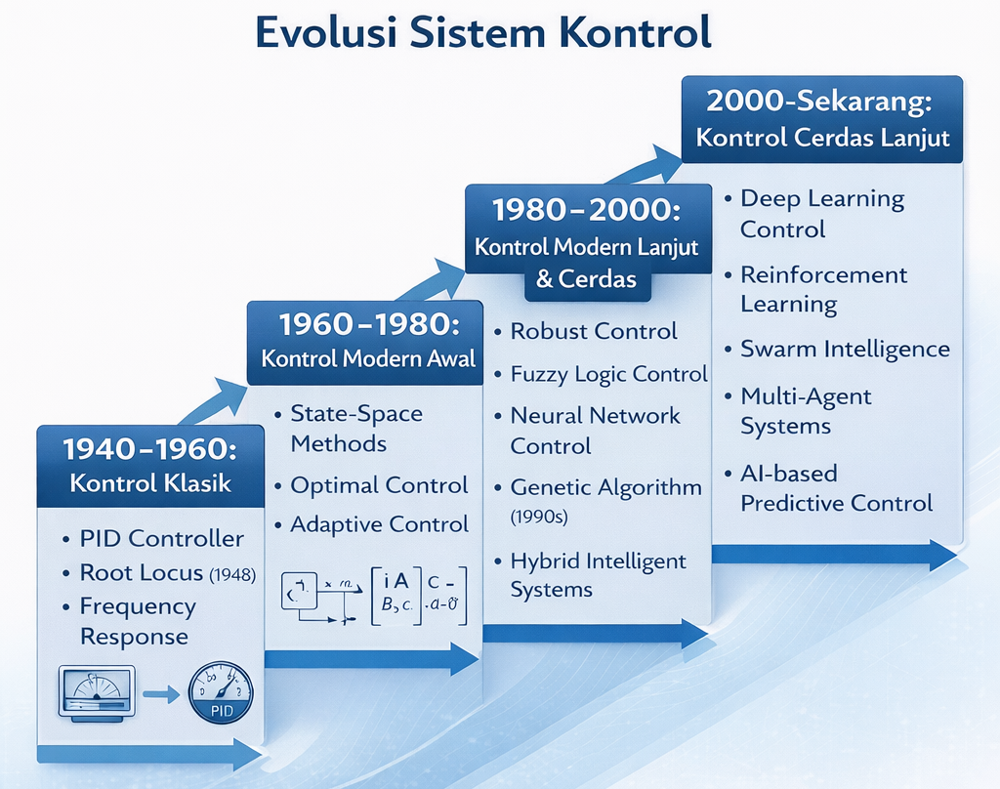
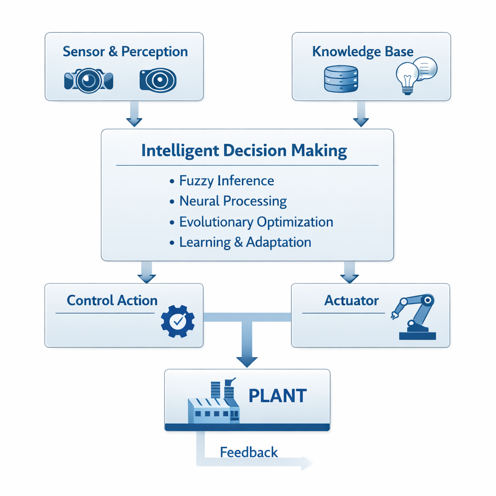
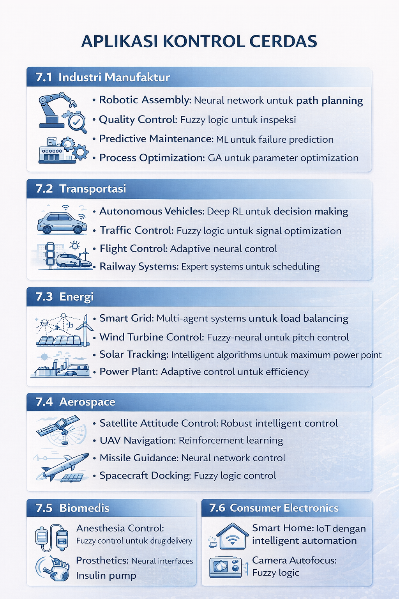

<div align="center">
  
</div>

<br>

<div style="background: linear-gradient(135deg, #0f172a, #1e3a8a); padding: 22px 28px; border-radius: 18px; color: white; box-shadow: 0 8px 24px rgba(0,0,0,0.15); margin-bottom: 18px;">
  <h1 style="margin: 0; text-align: center; font-size: 32px; letter-spacing: 1px;">MATERI PENGENALAN KONTROL CERDAS</h1>
  <p style="margin: 10px 0 0 0; text-align: center; font-size: 16px; opacity: 0.95;">Pengantar konsep, metode, aplikasi, dan arah perkembangan kontrol cerdas</p>
</div>

> <b>Cakupan Materi:</b> Kontrol cerdas merupakan salah satu perkembangan penting dalam dunia sistem kendali modern yang hadir untuk menjawab tantangan sistem nyata yang semakin kompleks, nonlinear, dinamis, dan penuh ketidakpastian. Berbeda dari kontrol konvensional yang umumnya sangat bergantung pada model matematis yang akurat, kontrol cerdas memadukan teori kontrol dengan pendekatan kecerdasan buatan agar sistem mampu belajar, beradaptasi, dan mengambil keputusan secara lebih fleksibel. Oleh karena itu, mempelajari kontrol cerdas menjadi penting bagi mahasiswa teknik, khususnya di era otomasi dan industri cerdas, karena bidang ini membuka wawasan tentang bagaimana mesin tidak hanya “mengikuti perintah,” tetapi juga dapat “merespons keadaan” secara lebih adaptif dan efisien.

<div style="height: 4px; background: linear-gradient(90deg, #2563eb, #06b6d4, #22c55e); border-radius: 999px; margin: 22px 0 28px 0;"></div>

<h2 style="color:#1d4ed8; border-left: 8px solid #1d4ed8; padding-left: 12px;">1. APA ITU KONTROL CERDAS?</h2>

<h3 style="color:#2563eb;">1.1 Definisi Kontrol Cerdas</h3>

**Kontrol Cerdas (Intelligent Control)** adalah bidang dalam teknik kontrol yang mengintegrasikan teknik-teknik kecerdasan buatan (*Artificial Intelligence*) dengan teori kontrol konvensional untuk mengatasi sistem yang kompleks, nonlinear, dan tidak pasti.

<div style="background:#eff6ff; border:1px solid #bfdbfe; border-left:6px solid #2563eb; padding:14px 16px; border-radius:12px; margin:14px 0;">
<b>Inti gagasan:</b> kontrol cerdas dipakai ketika sistem sulit dimodelkan secara presisi, banyak ketidakpastian, atau perilakunya berubah-ubah.
</div>

Kontrol cerdas merupakan pendekatan kontrol yang mampu:
- **Belajar** dari pengalaman dan data
- **Beradaptasi** terhadap perubahan kondisi sistem
- **Mengambil keputusan** dalam situasi yang tidak pasti
- **Menangani kompleksitas** yang sulit dimodelkan secara matematis
- **Meniru** kemampuan kognitif manusia dalam mengendalikan sistem

<h3 style="color:#2563eb;">1.2 Perbedaan dengan Kontrol Konvensional</h3>

| Aspek | Kontrol Konvensional | Kontrol Cerdas |
|:--|:--|:--|
| **Model Sistem** | Memerlukan model matematis yang akurat | Dapat bekerja tanpa model matematis eksplisit |
| **Linearitas** | Efektif untuk sistem linear | Dapat menangani sistem nonlinear kompleks |
| **Adaptasi** | Parameter tetap atau sedikit adaptif | Sangat adaptif, dapat belajar dari lingkungan |
| **Ketidakpastian** | Sulit menangani ketidakpastian besar | Lebih tangguh terhadap ketidakpastian |
| **Kompleksitas** | Terbatas pada sistem sederhana-menengah | Dapat menangani sistem sangat kompleks |
| **Basis Desain** | Teori matematis | AI, pembelajaran mesin, dan optimasi |

<div style="margin: 26px 0 18px 0; text-align:center; color:#64748b;">✦ ✦ ✦</div>

<h2 style="color:#9333ea; border-left: 8px solid #9333ea; padding-left: 12px;">2. MENGAPA DISEBUT “CERDAS”?</h2>

Istilah “cerdas” dalam kontrol cerdas merujuk pada karakteristik yang meniru kecerdasan biologis.

<h3 style="color:#7e22ce;">2.1 Kemampuan Pembelajaran (*Learning Capability*)</h3>

Sistem kontrol cerdas dapat **belajar** dari:
- **Data historis**
- **Pengalaman operasional**
- **Feedback lingkungan**

**Contoh:** *Neural network controller* yang meningkatkan akurasi kontrol seiring waktu operasi.

<h3 style="color:#7e22ce;">2.2 Kemampuan Adaptasi (*Adaptation*)</h3>

Kontrol cerdas dapat menyesuaikan diri terhadap:
- Perubahan parameter sistem
- Gangguan eksternal yang bervariasi
- Kondisi operasi yang berbeda
- Degradasi komponen

**Contoh:** *Adaptive fuzzy controller* yang mengubah aturan kontrol saat karakteristik *plant* berubah.

<h3 style="color:#7e22ce;">2.3 Penalaran dan Pengambilan Keputusan</h3>

Sistem dapat melakukan:
- **Penalaran logis** melalui aturan *if-then*
- **Inferensi fuzzy** untuk informasi yang kabur
- **Optimasi keputusan** dari berbagai alternatif

<h3 style="color:#7e22ce;">2.4 Pengenalan Pola (*Pattern Recognition*)</h3>

Kemampuan untuk:
- Mengidentifikasi pola dalam data sensor
- Mendeteksi anomali
- Mengklasifikasikan keadaan sistem

<h3 style="color:#7e22ce;">2.5 Generalisasi</h3>

Dapat menangani situasi baru dengan mengekstrapolasi pengetahuan yang sudah dimiliki.

<h3 style="color:#7e22ce;">2.6 Penanganan Ketidakpastian</h3>

Mampu bekerja meskipun terdapat:
- *Noise* pada pengukuran
- Ketidakpastian model
- Informasi tidak lengkap
- Ambiguitas spesifikasi

<div style="background:#faf5ff; border:1px solid #e9d5ff; border-left:6px solid #9333ea; padding:14px 16px; border-radius:12px; margin:16px 0;">
<b>Gagasan penting:</b> kecerdasan pada kontrol tidak berarti sistem “berpikir” seperti manusia sepenuhnya, tetapi memiliki kemampuan belajar, menyesuaikan diri, dan mengambil keputusan lebih fleksibel dibanding pendekatan klasik.
</div>

<div style="height: 4px; background: linear-gradient(90deg, #9333ea, #ec4899, #f59e0b); border-radius: 999px; margin: 24px 0 28px 0;"></div>

<h2 style="color:#ea580c; border-left: 8px solid #ea580c; padding-left: 12px;">3. EVOLUSI MENUJU KONTROL CERDAS</h2>

<h3 style="color:#c2410c;">3.1 Timeline Perkembangan</h3>

<div align="center">
  
</div>

<h3 style="color:#c2410c;">3.2 Motivasi Pengembangan Kontrol Cerdas</h3>

**Keterbatasan Kontrol Konvensional:**
1. **Kompleksitas model**
2. **Nonlinearitas**
3. **Perubahan parameter terhadap waktu**
4. **Sistem multivariabel**
5. **Ketidakpastian dan gangguan**

**Solusi dari Kontrol Cerdas:**
- Tidak menuntut model yang sangat presisi
- Mampu menghadapi nonlinearitas tinggi
- Lebih adaptif terhadap perubahan
- Dapat menangani hubungan multivariabel
- Lebih tangguh terhadap gangguan

<div style="margin: 26px 0 18px 0; text-align:center; color:#64748b;">◆ ◆ ◆</div>

<h2 style="color:#0f766e; border-left: 8px solid #0f766e; padding-left: 12px;">4. KARAKTERISTIK UTAMA KONTROL CERDAS</h2>

### 4.1 Autonomy (Kemandirian)
- *Self-monitoring*
- *Self-diagnosis*
- *Self-correction*
- *Self-optimization*

### 4.2 Robustness (Ketahanan)
- Tetap berkinerja baik saat ada gangguan, variasi parameter, atau kondisi ekstrem.

### 4.3 Flexibility (Fleksibilitas)
- Mudah dikonfigurasi ulang, *scalable*, dan dapat dipindahkan antar aplikasi.

### 4.4 Real-time Performance
- Komputasi cepat, *latency* rendah, dan *throughput* tinggi.

<div style="height: 4px; background: linear-gradient(90deg, #0f766e, #14b8a6, #84cc16); border-radius: 999px; margin: 24px 0 28px 0;"></div>

<h2 style="color:#be123c; border-left: 8px solid #be123c; padding-left: 12px;">5. KOMPONEN UTAMA SISTEM KONTROL CERDAS</h2>

<div align="center">
  
</div>

### 5.1 Knowledge Representation
- **Rule-based**
- **Fuzzy sets**
- **Neural weights**
- **Genetic encoding**

### 5.2 Inference Engine
- *Fuzzy inference systems*
- *Neural network forward propagation*
- *Genetic algorithm evolution*
- *Reinforcement learning policy*

### 5.3 Learning Mechanism
- *Supervised learning*
- *Unsupervised learning*
- *Reinforcement learning*
- *Online/offline learning*

<div style="background:#fff1f2; border:1px solid #fecdd3; border-left:6px solid #e11d48; padding:14px 16px; border-radius:12px; margin:16px 0;">
<b>Tips mengajar:</b> bagian ini sangat cocok dijelaskan seperti alur: sensor membaca kondisi, sistem memproses informasi, lalu aktuator mengeksekusi keputusan.
</div>

<div style="margin: 26px 0 18px 0; text-align:center; color:#64748b;">✦ ✧ ✦</div>

<h2 style="color:#1d4ed8; border-left: 8px solid #1d4ed8; padding-left: 12px;">6. JENIS-JENIS METODE KONTROL CERDAS</h2>

<h3 style="color:#2563eb;">6.1 Fuzzy Logic Control (FLC)</h3>

**Prinsip:**
- Menggunakan logika fuzzy untuk menangani ketidakpastian
- Berbasis aturan linguistik
- Meniru cara berpikir manusia

**Struktur:**
```text
Input → Fuzzification → Inference Engine → Defuzzification → Output
```

**Kelebihan:**
- Tidak memerlukan model matematis rinci
- Mudah diimplementasikan
- Dapat menggunakan pengetahuan pakar
- Tangguh terhadap *noise*

**Aplikasi:**
- Mesin cuci
- AC
- Sistem otomotif
- Kendali proses industri

<h3 style="color:#2563eb;">6.2 Neural Network Control (NNC)</h3>

**Prinsip:**
- Meniru struktur dan fungsi otak manusia
- Belajar dari data
- Mampu mendekati fungsi nonlinear

**Arsitektur umum:**
- *Feedforward Neural Networks*
- *Recurrent Neural Networks*
- *Convolutional Neural Networks*
- *Deep Neural Networks*

**Kelebihan:**
- Sangat baik untuk sistem nonlinear
- Kemampuan belajar kuat
- Generalisasi baik
- Dapat diproses paralel

**Aplikasi:**
- Kontrol robotika
- Pengenalan pola
- *Predictive control*
- *System identification*

<h3 style="color:#2563eb;">6.3 Genetic Algorithm (GA)</h3>

**Prinsip:**
- Meniru evolusi biologis
- Optimasi melalui seleksi, *crossover*, dan mutasi
- Pencarian global dalam ruang solusi

**Proses:**
```text
1. Initialization
2. Fitness Evaluation
3. Selection
4. Crossover
5. Mutation
6. Replacement
7. Repeat until convergence
```

**Kelebihan:**
- Optimasi global
- Mengurangi risiko *local minima*
- Dapat melakukan pencarian paralel
- Tidak memerlukan gradien

<h3 style="color:#2563eb;">6.4 Reinforcement Learning (RL)</h3>

**Prinsip:**
- *Agent* belajar dari interaksi dengan *environment*
- Menggunakan *reward* dan *punishment*
- Belajar dengan *trial and error*

**Komponen:**
- **Agent**
- **Environment**
- **State**
- **Action**
- **Reward**

<h3 style="color:#2563eb;">6.5 Expert Systems</h3>

**Prinsip:**
- Menyimpan pengetahuan pakar dalam *rule base*
- Memanfaatkan *inference engine*
- Dapat memberi penjelasan keputusan

<h3 style="color:#2563eb;">6.6 Hybrid Intelligent Control</h3>

**Konsep:** menggabungkan beberapa metode agar keunggulan masing-masing dapat dimanfaatkan.

**Kombinasi populer:**
1. **Neuro-Fuzzy Systems**
2. **Fuzzy-Genetic Systems**
3. **Neuro-Genetic Systems**
4. **Deep Reinforcement Learning**

<div style="height: 4px; background: linear-gradient(90deg, #2563eb, #0ea5e9, #22c55e); border-radius: 999px; margin: 24px 0 28px 0;"></div>

<h2 style="color:#7c3aed; border-left: 8px solid #7c3aed; padding-left: 12px;">7. APLIKASI KONTROL CERDAS</h2>

<div align="center">
  
</div>

### 7.1 Industri Manufaktur
- *Robotic assembly*
- *Quality control*
- *Predictive maintenance*
- *Process optimization*

### 7.2 Transportasi
- Kendaraan otonom
- Kendali lalu lintas
- Kendali penerbangan
- Sistem perkeretaapian

### 7.3 Energi
- *Smart grid*
- Kontrol turbin angin
- *Solar tracking*
- Optimalisasi pembangkit

### 7.4 Aerospace
- Kontrol satelit
- Navigasi UAV
- *Missile guidance*
- *Spacecraft docking*

### 7.5 Biomedis
- Kendali anestesi
- Prostetik
- *Insulin pump*
- Kendali ventilator

### 7.6 Consumer Electronics
- *Smart home*
- Kamera *autofocus*
- Mesin cuci pintar
- AC pintar

<div style="margin: 26px 0 18px 0; text-align:center; color:#64748b;">◇ ◇ ◇</div>

<h2 style="color:#15803d; border-left: 8px solid #15803d; padding-left: 12px;">8. KEUNGGULAN KONTROL CERDAS</h2>

### 8.1 Keunggulan Teknis
1. **Model-Free Operation**
2. **Nonlinearity Handling**
3. **Uncertainty Management**
4. **Adaptability**
5. **Scalability**

### 8.2 Keunggulan Operasional
1. **Reduced Development Time**
2. **Improved Performance**
3. **Cost Effectiveness**
4. **Flexibility**

<h2 style="color:#dc2626; border-left: 8px solid #dc2626; padding-left: 12px;">9. TANTANGAN DAN KETERBATASAN</h2>

### 9.1 Tantangan Implementasi
1. **Computational Complexity**
2. **Training Data Requirements**
3. **Interpretability**
4. **Stability and Safety**
5. **Parameter Tuning**

### 9.2 Keterbatasan
1. Tidak selalu optimal untuk sistem yang sederhana dan sudah dipahami baik
2. Memerlukan keahlian di AI dan teori kontrol
3. Validasi dan verifikasi lebih kompleks
4. Standardisasi masih terbatas

<div style="background:#fef2f2; border:1px solid #fecaca; border-left:6px solid #dc2626; padding:14px 16px; border-radius:12px; margin:16px 0;">
<b>Poin refleksi:</b> kontrol cerdas sangat kuat, tetapi tidak otomatis selalu menjadi pilihan terbaik. Pemilihan metode harus disesuaikan dengan karakteristik sistem, data, kebutuhan real-time, dan aspek keselamatan.
</div>

<div style="height: 4px; background: linear-gradient(90deg, #dc2626, #f97316, #eab308); border-radius: 999px; margin: 24px 0 28px 0;"></div>

<h2 style="color:#0891b2; border-left: 8px solid #0891b2; padding-left: 12px;">10. TREN DAN MASA DEPAN KONTROL CERDAS</h2>

### 10.1 Tren Terkini (2020–2026)
1. **Deep Learning Control**
2. **Edge AI for Control**
3. **Digital Twin Integration**
4. **Explainable AI (XAI) in Control**
5. **Federated Learning**

### 10.2 Arah Masa Depan
1. **Autonomous Systems**
2. **Human-AI Collaboration**
3. **Quantum Control**
4. **Bio-inspired Control**
5. **Sustainable Intelligent Control**

<h2 style="color:#b45309; border-left: 8px solid #b45309; padding-left: 12px;">11. STUDI KASUS</h2>

### Kasus 1: Fuzzy Logic Control pada Kereta Bawah Tanah Sendai
**Problem:** kontrol kecepatan yang *smooth*, efisiensi energi, kenyamanan penumpang.

**Solusi:** *Fuzzy logic controller* dengan input *speed error* dan jarak ke stasiun.

**Hasil:** penghematan energi, kenyamanan meningkat, operasi lebih halus.

### Kasus 2: Neural Network Control untuk Robotic Manipulator
**Problem:** *trajectory tracking* robot 6-DOF, nonlinearitas tinggi, *payload* bervariasi.

**Solusi:** *Recurrent neural network controller* dengan *online learning*.

**Hasil:** *tracking error* rendah dan adaptif terhadap perubahan beban.

### Kasus 3: Genetic Algorithm untuk Tuning PID
**Problem:** penyetelan PID untuk sistem MIMO yang kompleks.

**Solusi:** optimasi parameter `Kp`, `Ki`, dan `Kd` menggunakan GA.

**Hasil:** performa lebih baik dibanding penyetelan manual.

<div style="margin: 26px 0 18px 0; text-align:center; color:#64748b;">✦ ❖ ✦</div>

<h2 style="color:#0369a1; border-left: 8px solid #0369a1; padding-left: 12px;">12. LANGKAH AWAL MEMPELAJARI KONTROL CERDAS</h2>

### 12.1 Fondasi yang Diperlukan
**Matematika:**
- Aljabar linear
- Kalkulus
- Probabilitas dan statistika
- Optimasi

**Kontrol dasar:**
- Kontrol klasik
- Kontrol modern
- Kontrol digital

**Pemrograman:**
- Python / MATLAB
- Simulink
- TensorFlow / PyTorch

### 12.2 Roadmap Pembelajaran
**Level 1: Beginner**
1. Pelajari Fuzzy Logic Control
2. Implementasi FLC sederhana
3. Simulasi di MATLAB/Simulink

**Level 2: Intermediate**
1. Neural networks untuk kontrol
2. Genetic algorithm
3. Sistem hybrid

**Level 3: Advanced**
1. Reinforcement learning
2. Deep learning control
3. Multi-agent systems
4. Implementasi dunia nyata

### 12.3 Resources
**Buku:**
- *Intelligent Control Systems* — Guanrong Chen & Trung Tat Pham
- *Neural Network Control of Robot Manipulators* — F.L. Lewis
- *Fuzzy Control* — Kevin M. Passino & Stephen Yurkovich

**Online Courses:**
- Coursera
- edX
- YouTube

**Software Tools:**
- MATLAB Fuzzy Logic Toolbox
- Python: scikit-fuzzy, TensorFlow
- Simulink Control Design

<h2 style="color:#111827; border-left: 8px solid #111827; padding-left: 12px;">13. KESIMPULAN</h2>

<div style="background:#f8fafc; border:1px solid #cbd5e1; border-left:6px solid #0f172a; padding:16px 18px; border-radius:12px; margin:14px 0;">
  <b>Ringkasan poin penting:</b>
  <ol>
    <li><b>Kontrol Cerdas</b> adalah integrasi AI dengan teori kontrol untuk menghadapi sistem kompleks, nonlinear, dan tidak pasti.</li>
    <li>Disebut <b>“cerdas”</b> karena dapat belajar, beradaptasi, menangani ketidakpastian, dan meniru penalaran manusia.</li>
    <li>Metode utama meliputi fuzzy logic, neural networks, genetic algorithms, reinforcement learning, dan sistem hybrid.</li>
    <li>Keunggulannya terletak pada kemampuan model-free, adaptasi, dan penanganan nonlinearitas.</li>
    <li>Aplikasinya luas, mulai dari industri hingga consumer electronics.</li>
    <li>Masa depannya terkait erat dengan deep learning, edge AI, explainable AI, dan autonomous systems.</li>
  </ol>
</div>

### Pesan Akhir
Kontrol cerdas bukan pengganti kontrol konvensional, tetapi **pelengkap yang sangat kuat** untuk masalah-masalah yang sulit atau tidak efisien diselesaikan dengan pendekatan klasik.

<div style="height: 4px; background: linear-gradient(90deg, #111827, #475569, #94a3b8); border-radius: 999px; margin: 24px 0 28px 0;"></div>

<h2 style="color:#334155; border-left: 8px solid #334155; padding-left: 12px;">REFERENSI</h2>

1. Passino, K. M., & Yurkovich, S. (1998). *Fuzzy Control*. Addison-Wesley.
2. Lewis, F. L., Jagannathan, S., & Yesildirak, A. (1998). *Neural Network Control of Robot Manipulators and Non-linear Systems*. CRC Press.
3. Jang, J. S. R., Sun, C. T., & Mizutani, E. (1997). *Neuro-Fuzzy and Soft Computing*. Prentice Hall.
4. Sutton, R. S., & Barto, A. G. (2018). *Reinforcement Learning: An Introduction* (2nd ed.). MIT Press.
5. Åström, K. J., & Wittenmark, B. (2013). *Adaptive Control* (2nd ed.). Dover Publications.
6. Goldberg, D. E. (1989). *Genetic Algorithms in Search, Optimization, and Machine Learning*. Addison-Wesley.
7. Zadeh, L. A. (1965). Fuzzy sets. *Information and Control*, 8(3), 338–353.
8. Rumelhart, D. E., Hinton, G. E., & Williams, R. J. (1986). Learning representations by back-propagating errors. *Nature*, 323(6088), 533–536.
9. Goodfellow, I., Bengio, Y., & Courville, A. (2016). *Deep Learning*. MIT Press.
10. Russell, S., & Norvig, P. (2020). *Artificial Intelligence: A Modern Approach* (4th ed.). Pearson.
